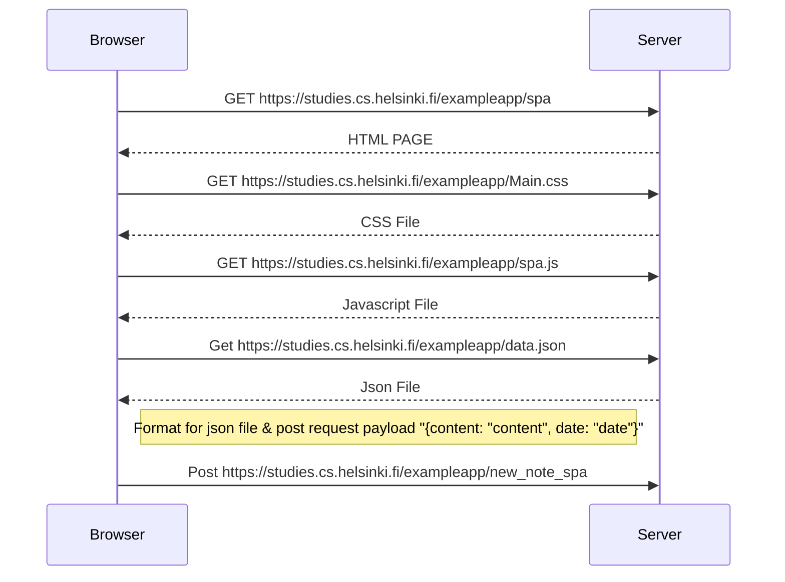

```mermaid
sequenceDiagram
    participant Browser
    participant Server

    Browser ->> Server : GET https://studies.cs.helsinki.fi/exampleapp/spa
    Server -->> Browser  : HTML PAGE
    Browser ->> Server : GET https://studies.cs.helsinki.fi/exampleapp/Main.css
    Server -->> Browser  : CSS File
    Browser ->> Server : GET https://studies.cs.helsinki.fi/exampleapp/spa.js
    Server -->> Browser  : Javascript File
    Browser ->> Server : Get https://studies.cs.helsinki.fi/exampleapp/data.json
    Server -->> Browser  : Json File
    Note left of Server:  Format for json file & post request payload "{content: "content", date: "date"}"
    Browser ->> Server : Post https://studies.cs.helsinki.fi/exampleapp/new_note_spa 

```

